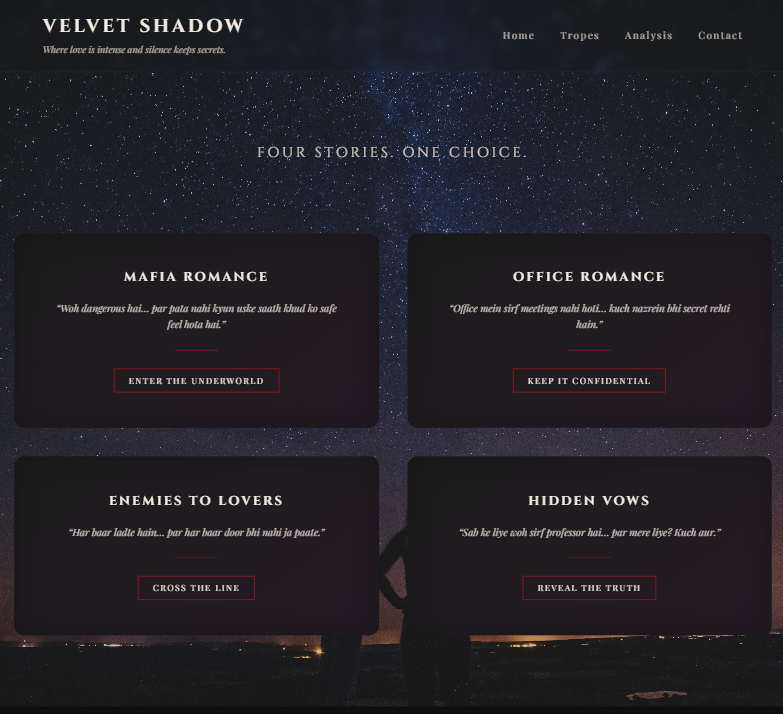
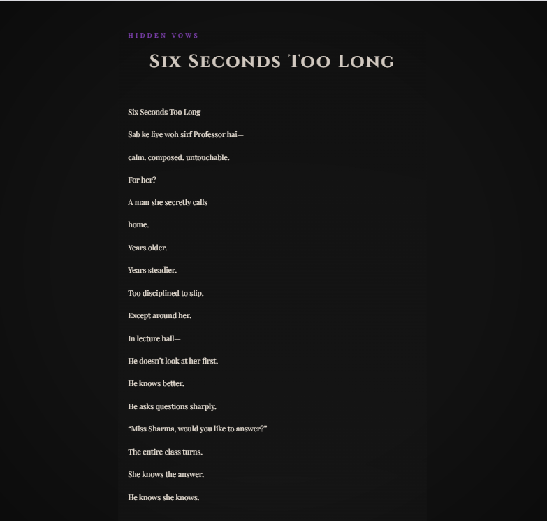
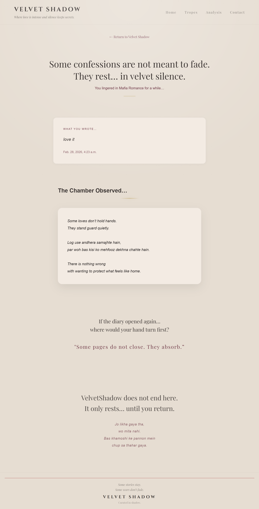

# 🖤 Velvet Shadow

> Where love is intense and silence keeps secrets.

Velvet Shadow is a cinematic storytelling web experience built with Django.  
It is not just a website — it is an atmosphere.

Users explore emotional romance tropes, read poetic story pages, write reflections, and enter the Shadow Chamber where their thoughts are quietly observed.

---

## 🌍 Live Preview

✨ Coming Soon  
(Deployment in progress)

---

## 📸 Preview

### 🏠 Home Page


### 📖 Story Page


### 🌑 Shadow Chamber


---

## ✨ Features

- 🌌 Cinematic dark aesthetic design  
- 📚 Four interactive romance tropes  
- ✍ Reflection submission system  
- 🧠 Chamber observation logic  
- 🗳 Mystic poll interaction  
- 🎵 Soft audio experience after poll submission  
- 🌑 Emotional closing section  

---

## 🛠 Tech Stack

- Python  
- Django  
- HTML  
- CSS  
- JavaScript  
- SQLite  

---

```
## 📂 Project Structure
velvet-shadow/
│
├── VelvetShadow/        # Django project settings
├── shadowverse/         # Main app (views, models, templates)
│   ├── models.py        # Reflection & chamber logic
│   ├── views.py         # Page rendering & poll handling
│   ├── templates/       # Home, Story, Chamber pages
│   └── static/          # CSS, images, audio files
│
├── assets/              # GitHub preview screenshots
├── manage.py
└── README.md
```


